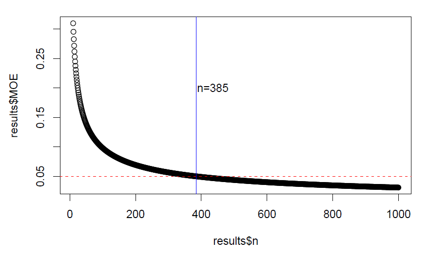

```{r setup, include=FALSE}
rm( list = ls()) #clear env
library(knitr)
library(tinytex)
library(tidyverse)
library(data.table)
library(gtools)
```

## [Introduction]{.underline}

This document provides an overview of the methods used to estimate the number of aged scales required to accurately estimate the abundance of each age-class of natural-origin Sacramento River fall-run Chinook Salmon (SFCS). The analysis I review here is in response to two questions from the Scales/CWT subgroup supporting efforts to implement cohort reconstruction (CR) efforts in the Sacramento River Basin.

Throughout this document, various chunks of R code will be presented in the following format:

```{r, example chunk} print("hello reader")}
```

These chunks are designed for users to copy and paste, or rewrite entirely, into their own R scripts to replicate the methods. The functions discussed in this document can also be found in the "CVCS_functions.R" script included in the workshop repository. Additionally, the code used in this document relies on the following R packages: `tidyverse`, `ggplot2`, `datatable`.

## [Sampling questions]{.underline}

Q1: How many scales do we need to sample from recovered untagged fish to accurately estimate the proportion of age classes in natural-origin fish?

-   How many scale samples to hit a target margin-of-error (MOE) 95% of the time?

-   How many to minimize the number of false-positives (estimating a presence when none occurs) for a natural-origin age class?

-   How many to minimize the number of false-negatives (failing to estimate a presence when they are available)?

Q2: Instead of aging some minimum number of scales from each tributary and hatchery, could we pool samples across the Sacramento River basin for a single CR? Could this be done to reduce effort/cost?

-   What are the assumptions of this method, and what could be lost with this approach?

## [Review of Cohort Reconstruction Methods]{.underline}

### Accounting for uncertainty

Let's assume the simplest of systems of a population of SFCS in which we can know for certain the origin of a fish in hand and have a perfect estimate of the abundance of fish in the population. This could be a hatchery in which all hatchery-origin fish originate from Parental-Based-Tagging brood pairs and all fish that enter the hatchery are counted. In this system we can estimate the number of scales that need to be sampled and aged ($\hat{n}$) to meet a target margin of error (MOE) as:

$$
\hat{n}=\frac{Z^2_{a/2}*\hat{p}_a*(1-\hat{p}_a)}{MOE^2}
$$

Where $Z_{a/2}$ is the critical value of the normal distribution (for a confidence level of 95%, $Z_{a/2}=1.96$), and the age class proportion estimate is $\hat{p}_a$. We can use this equation for an infinite population to find that the number of scale samples to collect to estimate the proportion of each age class with a 5% MOE with 95% confidence is 385 @fig-pbt_MOE.

{#fig-pbt_MOE fig-align="center"}

In this simple hatchery system, assuming that age classification and identification of origin is perfect, all of our uncertainty in the age-class proportion estimate comes from how many fish get sampled for scales. Unfortunately our CR efforts are much more complex.

The CR methodology requires us to collect scale samples from tributary spawning grounds across the Sacramento River basin, and needs to incorporate uncertainty from many different sources:

-   Fish recovery rate ( $\theta$ ) - The sampling fraction of the survey, or probability of recovering the tag of a given fish. This is derived from the "estimated number' reported in RMIS.

-   Tag rate expansion ($F_{prod}$) - The tag rate expansion method used to estimate number of all hatchery-origin fish in population (tagged and untagged).

-   Scale subsampling ($n_{NO-CWT}$) - The number of scales sampled from the untagged recovered fish for aging. Scales that are sampled can be bootstrapped by redrawing with replacement 1000 times to characterize sampling uncertainty.

There are two other sources of uncertainty that are either not dealt with in CR methods, or not dealt with in my analysis:

-   Escapement estimates ($\hat{N}$) - Estimates of total SFCS in natural spawning grounds are reported as point estimates in GrandTab, but there is significant uncertainty in these estimates generated by the Cormack-Jolly-Seber mark-recapture models.

-   Scale aging bias and correction - The age distribution of spawners is corrected using a confusion matrix developed by comparing read age from scales from fish with known date of birth from CWT. This was left out of my simulation methods, as I would have had to simulate bias and then simulate the correction to that bias, and would have been superflurous to the efforts.

The multiple steps and sources of uncertainty incorporated in the CR methods ensure that there is no closed-form equation readily available to estimate the number of scale samples needed to accurately estimate the size of each age class of natural-origin SFCS. To address these questions we can instead use a series of Monte Carlo simulations to replicate proposed sampling methods and compare statistical power.

## [Monte Carlo Simulations]{.underline}

The Monte Carlo approach is the following:

1.  Simulate known populations of SFCS for various survey locations.

2.  Simulate recovery of tagged and un-marked fish from surveys.

3.  Replicate $k$ draw methods and scale sampling to characterize uncertainty.

4.  Run simulations across various parameters.

5.  Analyze results to determine target scale sample sizes for goals.

```{r load functions, message=FALSE}
#| warning: false
#| include: false
#| paged-print: false
#load functions
sapply(list.files("scripts/functions", pattern = "\\.R$", full.names = TRUE), source)

#set seed for reproducibility
set.seed(67)
```

### Simulate a known population

There are two functions I wrote to simulate SFCS populations for sampling:

-   `sim_pop()` - simulates a theoretical population using specific user inputs for parameters:

    -   `N` = true abundance.

    -   `h_prop` = proportion of population of hatchery origin fish. Default 0.75.

    -   `tag rate` = hatchery-origin fish tag rate ($F_{prod}$). Default 0.25.

    -   `ages` = list of possible fish ages. Default ages 2, 3, and 4.

    -   `age_probs` = list of fixed proportions of each age class. Default 0.15, 0.60, 0.25.

    -   `random_age_probs`=whether to add random "noise" to age probabilities. Default TRUE.

    -   `age_var_origin` = whether to use different probabilities for hatchery vs natural origin fish. Default TRUE.

    -   `age_dirichlet_conecntration` = Dirichlet concentration value to use to add random noise to age probabilities. Default 100.

We can run a simple call of `sim_pop()` and see the output below output `sim1`: a simulated population of 10,000 returning SFCS, a data frame with each record representing a fish, it's origin, age, and whether or not is has a CWT.

```{r,sim_pop example}
sim1<-sim_pop(N=10000)
head(sim1)
```

### Simulate fish recovery

Now that we've generated a simulated population we can simulate the recovery of fish for a theoretical spawning carcass survey. Over a given spawning period some portion of the escapement would be recovered, which can be characterized with $\theta$. We can replicate this process with the `sim_spawning_recovery()` function and the following inputs:

-   `sim_population` = a data frame of the simulated population.

-   `theta` ($\theta$)= probability of recovering a given fish, or the sampling fraction. Default 0.20.

-   `tag_rate` = hatchery-origin fish tag rate ($F_{prod}$). Default 0.25.

-   `iterations` = number of draws from from a negative-binomial distribution to estimate k, where $k\sim NB(1,\theta)$. Default 1000.

We can use the default values and run a simulated spawning recovery event below.

```{r, sim_spawning_recovery1}
spawning_recoveries<-sim_spawning_recovery(sim_population = sim1)
```

The `sim_spawning_recovery()` function outputs a list with two data frames, the first is `recovered_fish`, a table of all the fish "recovered" from the total population. This output gives us the true age and origin for each fish, and whether or not that fish has a CWT.

```{r, sim_spawning_recovery2}
#show table of recovered fish
head(spawning_recoveries$recovered_fish)
```

The second output is the `hatchery_ages` data frame, with estimates of the total abundance of hatchery-origin fish for each age class, for each iteration of the $k$-draw process. For each tagged fish recovered, we utilize a $k\sim NB(1,\theta)$ draw to get an estimate of the number of tagged fish not recovered.

The repetitive iterations help us characterize the uncertainty of our hatchery-origin estimate ($\hat{N}_{CWT,a}$) due to $\theta$. The table should have a number of records equal to the number of age classes $a$ times the number of $k$ iterations, and has the following outputs:

-   `age` = target age class of hatchery-origin fish.

-   `N` = the number of recovered fish with tags for each age class.

-   `total_tags` = the estimate of the total number of fish with tags in the population for that age class. $k+1$ is the estimate of the number of tagged fish available for each tag recovered. The `total_tags` value ($\hat{N}_{CWT,a}$) is estimated as:\
    $$\hat{N}_{CWT,a}=\sum_{t=1}^j(k_{t,a}+1)$$

-   `total_hatchery` ($\hat{N}_{ho,a}$) = is the estimate of total abundance of hatchery-origin fish for each age-class in the population, estimated as $\hat{N}_{CWT,a} * F{prod}$.

-   `k_iteration` = is the number of the $k$-draw iteration.

```{r, sim_spawning_recovery3}
#show table of estimates of hatchery origin fish
head(spawning_recoveries$hatchery_ages)
```

### Simulate scale sampling and aging

We can now pass the fish we "recovered" and our estimates of hatchery-origin abundance for each age class onto the workhorse function `sim_scales_sampling()`. This function simulates sampling of scales from our recovered fish, boot straps scale samples for uncertainty, and produces estimates of natural-origin abundance for each age-class, as well as uncertainty metrics. The inputs for `sim_scale_sampling()` are:

-   `pop` = the simulated population data frame produced by `sim_pop()`.

-   `spawning_results` = the output of the `sim_spawning_recovery()` function. Must be the list with two data frames `spawning_recoveries$recovered_fish` and `spawning_recoveries$hatchery_ages`.

-   `iterations` = number of draws from from a negative-binomial distribution to estimate k, where $k\sim NB(1,\theta)$. Default 1000. In this function also the number of iterations to bootstrap resampling of the scale subsample to characterize scale sampling uncertainty.

-   `scales_n` = number of scale samples to collect and "age" from recovered fish.

-   `CI` = confidence intervals used to calculate upper and lower confidence intervals of natural-origin age class estimates produced from scale `iterations` bootstrapping. Default 0.95.

Running the function below with the default values and our simulated population and recoveries, and a scale sample size (`scale_n`) of 500 typically takes my computer around 15 seconds. It's useful to time how long this process can take as later it will be iterated many times in different scenarios.

```{r, sim_scales_sampling1}
sim_start<-Sys.time()
scale_results<-sim_scales_sampling(pop=sim1,
                                   spawning_results=spawning_recoveries,
                                   scales_n=500)
sim_end<-Sys.time()
print(sim_end-sim_start)
```

The function starts by selecting a random sample of untagged fish records from the `spawning_recoveries$recovered_fish` input as our "aged scales" in which we assume we know each of those fishes age perfectly, but not their origin. Then for each of the boot strap `iterations` the `sim_scales_sampling()` function does the following:

1.  Resample the scales from untagged recoveries with replacement.

2.  Pulls an iteration of the hatchery-origin age class abundance estimates from the `spawning_recoveries$hatchery_ages` data frame.

3.  Estimate the total number of fish without tags in population as: $$\hat{N}_{NO-CWT}=\hat{N}-\hat{N}_{CWT}$$

    -   note: for our simulations $\hat{N}$ is a known value from our simulation. In real surveys this value is a point estimate from carcass surveys with unreported uncertainty.

4.  For each cohort $a$ in the boot iteration:

    -   calculate the number of untagged fish scales from that cohort ($n_{NO-CWT,a}$).

    -   calculate the proportion of untagged fish scales from that cohort ($p_{NO-CWT,a}$).

    -   estimate the total number of untagged fish in the populations from that cohort: $$\hat{N}_{NO-CWT}*p_{NO-CWT,a}=\hat{N}_{NO-CWT,a}$$

5.  Merge the untagged age-class estimates with the hatchery-origin estimates by age-class.

6.  Estimate the number of untagged hatchery-origin fish in the population as: $$\hat{N}_{NO-CWT,ho,a}=\hat{N}_{ho,a}-\hat{N}_{CWT,a}$$

7.  Estimate the number of natural-origin fish in the population at each age class: $$\hat{N}_{no,a}=\hat{N}_{NO-CWT,a}-\hat{N}_{NO-cwt,ho,a}$$

8.  Estimate the proportions of natural-origin fish at each age class ($\hat{p}_{NO,a}$). This is the proportion of the natural-origin population in each age class, so that $\sum_{a=1}^j\hat{p}_{NO,a}=1$.

The above results for each iteration are then used to produce summary statistics of mean proportion of each age class for natural-origin and hatchery-origin fish, standard deviations, and lower and upper confidence intervals. Finally the function pulls calculates the true age-class proportions and abundances from the simulated population.

There are three outputs from the `sim_scales_sampling()` function, the `age_summary_stats` table, the `true_summary_stats` table, and the `scales_collected` value.

```{r,sim_scales_sampling2}
str(scale_results$age_summary_stats)
```

The `age_summary_stats` table has the following fields:

-   `age` = target age class of hatchery-origin fish.

-   `mean_count_hatchery` = the mean abundance of hatchery-origin fish for each age class $\hat{N}_{ho,a}$ from bootstrapping iterations.

-   `mean_count_natural` = the mean of abundance of natural-origin fish for each age class $\hat{N}_{no,a}$ from bootstrapping iterations.

-   `mean_proportion_natural` = the mean proportion of natural-origin fish at each age class $\hat{p}_{no,a}$.

-   `sd_proportion_natural` = the standard deviation of the proportion of natural-origin fish at each age class.

-   `se_proportion_natural` = the standard error of the proportion of natural-origin fish at each age class.

-   `lower_CI_prop` and `upper_CI_prop` = the upper and lower confidence intervals of our natural-origin age class proportion estimates.

-   `lower_CI_count` and `upper_CI_count` = the upper and lower confidence intervals of our natural-origin age class count estimates.

-   `n_iterations` = the number of bootstrapping iterations performed.

```{r,sim_scales_sampling3}
head(scale_results$true_summary_stats)
```

The `true_summary_stats` table above contains the true counts and proportional information for hatchery and natural-origin fish from the simulated population to be used in comparison.

\########################################

### Simulate populations from real data

-   `sim_location_pop()` - simulates a population by taking random draws from the distribution of age class abundance estimates produced by Emily Chen's work (<https://github.com/echenfishbitch/SRFC-cohort-reconstruction-wNF>). It requires the following inputs:

    -   `data` = a cleaned and formatted data set of survey based estimates containing distributions of age class abundances for each spawning ground/hatchery and each year, as well as tag rates. Data formatted in the `clean_recovery_estimates.R` script.

    -   `iter` = which estimate iteration to pull from, this is used when bootstrapping across available data for uncertainty.

    -   `year` = the target year for which population data will be pulled.

Before running an example of `sim_location_pop()` we can examine the input abundance estimate data here:

```{r, sim_location_pop 1}
trib_data<-readRDS("data/all_returns_clean.Rds")
head(trib_data)

```

We can then run the above formatted data through our simulation function. The output is similar to the output of `sim_pop()` but this time includes the location of the fish, and simulates the population of the entire basin pooled across different survey areas.

```{r, sim_location_pop 2}
sim2<-sim_location_pop(trib_data,
                       iter=1,
                       year=2012)
head(sim2)
```

## [Results and Conclusions]{.underline}
