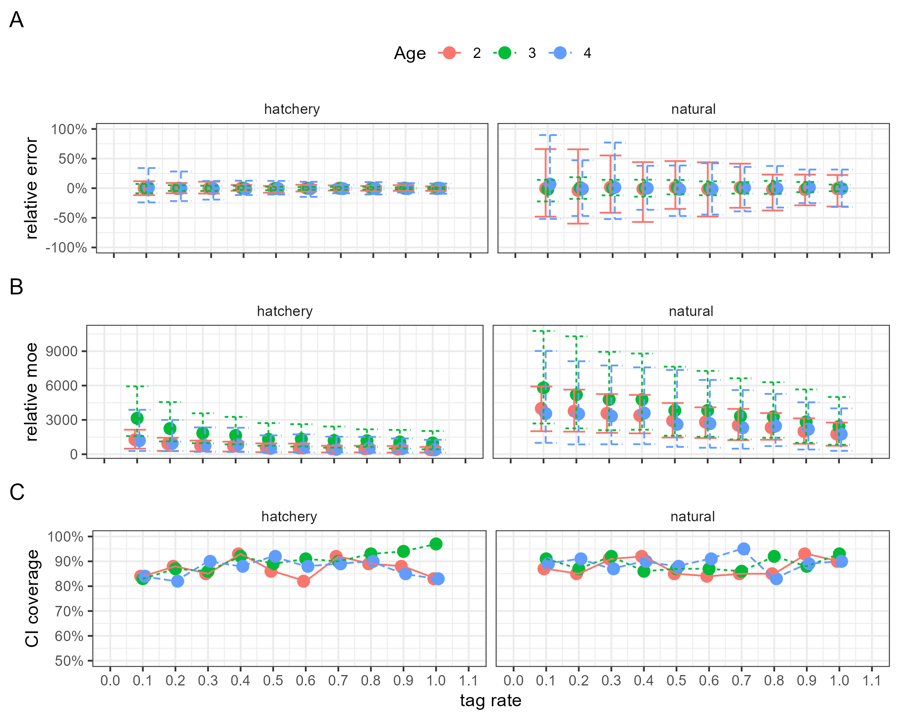
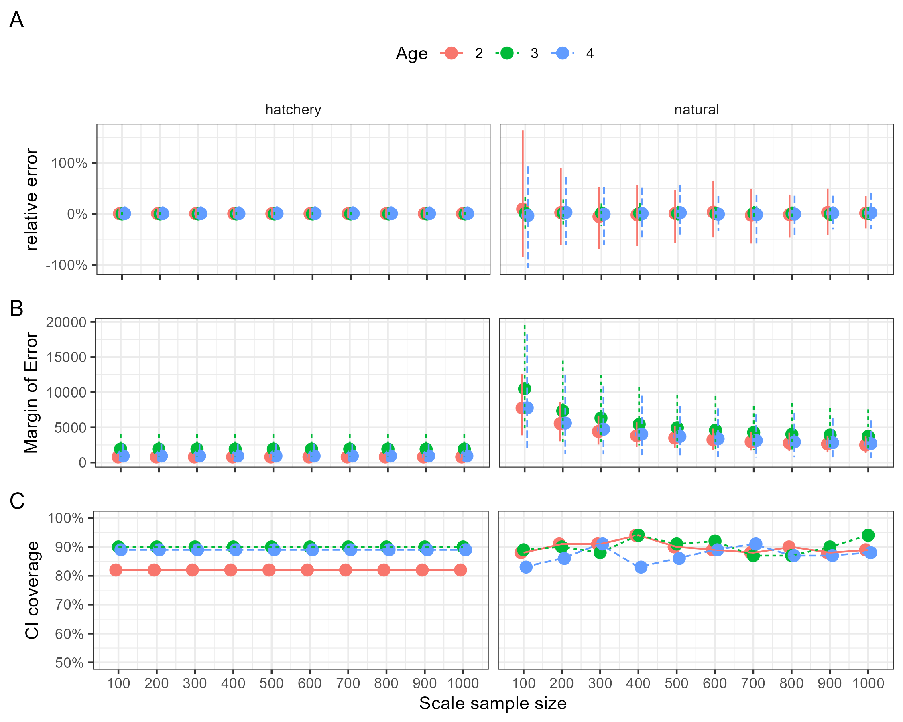

```{r setup, include=FALSE}
rm( list = ls()) #clear env
library(knitr)
library(tinytex)
library(tidyverse)
library(data.table)
library(gtools)
library(gridExtra)
library(flextable)
knitr::opts_chunk$set(
	echo = TRUE,
	message = FALSE,
	warning = FALSE
)

set_flextable_defaults(big.mark = "")

#load relevant CR functions
sapply(list.files("scripts/functions", pattern = "\\.R$", full.names = TRUE), source)
 
```

## Introduction

Efforts to implement age-structured cohort reconstruction (CR) of Sacramento River fall-run Chinook Salmon (SFCS) populations are under way. The currently used Sacramento Index (SI) serves as an age-aggregated index of adult ocean abundance and potential adult escapement [@Chen2024]. The CR efforts aim to improve upon this method by reporting age-specific assessments of hatchery and natural-origin escapement with estimates of uncertainty for the entire Sacramento River Basin (SRB). Accurate estimates of age-specific escapement can be used to estimate maturation rates, mortality rates, and rates of exploitation to facilitate more informed management decisions.

The hatchery-origin component of escapement is estimated using recovered coded-wire-tag (CWT), while the natural-origin component is reconstructed by aging scales collected from recovered fish without tags. At the end of each spawning season survey crews will be expected to contribute relevant data and a sample of scales from untagged fish that will be pooled together with other locations to produce basin-wide estimates of natural-origin age classes.

This document aims to provide guidance to SRB escapement surveyors on collecting scales for aging and providing the data needed to produce annual age-class abundance estimates of SFCS. It also provides the data processing steps and R functions necessary for a CR coordinator to take the survey and scale age data and produce final estimates of cohort abundance for the SRB. The data used in this document is simulated SFCS population and recovery numbers produced from historical data found at [https://github.com/echenfishbitch/SRFC-cohort-reconstruct](https://github.com/echenfishbitch/SRFC-cohort-reconstruction-wNF)ut this document various chunks of R code will be presented in the following format:

```{r}
print("hello reader")
```

These chunks are designed for users to reuse at will and replicate the methods described. The functions and methods described are reliant on the following R packages: [`tidyverse`](https://tidyverse.org/) and [`datatable`](https://cran.r-project.org/web/packages/data.table/vignettes/datatable-intro.html). Example data and code for the functions used is maintained at: <https://github.com/arthurbarros-CDFW/CR_sampling/>.

## Ensuring Unbiased Scale Recovery

During the course of recovering spawning SFCS, whether collected at a hatchery or during carcass surveys of a natural spawning ground, crews are typically expected to collect scales for use in estimating the age of recovered fish. For many survey locations, collecting scales from each fish encountered is an unwieldy effort, so sub-sampling must occur. It is important for surveyors to ensure the process for sub-sampling scales is random and does not bias the final CR estimates. If scale collection is front loaded during the sampling season, it could result in an age cohort or origin group being over or underrepresented in the sample, biasing final estimates.

Some survey areas such as Clear Creek or the Yuba river may only encounter a few hundred fish in a given season, so sub-sampling would not be necessary or recommended, to ensure enough scales are collected for CR estimates. Other surveys on the American or Feather River can anticipate encountering tens of thousands of fish. The most unbiased method of sub-sampling is to collect scales from every $n^{th}$ fish encountered, for example every second or fourth, depending on the expected number of fish. This entails some foreknowledge of how many fish may be expected, and how many scales will be needed for CR aging from a given location. **These details are still being worked out.**

## Data needs

```{r load_loc_data, echo=FALSE}
#read in pre-simulated data
loc_data<-readRDS("outputs/sim_loc_data.rds")
```

At the end of escapement surveys in SRB natural spawning grounds and hatcheries, each survey group should be able to provide the following data to the CR coordinator:

1.  $\hat{N}_{l}$ - The estimate of abundance for each location $l$ in the basin. For hatcheries this value should be close to exact, but for carcass and other spawning ground surveys there should be uncertainty in this estimate. Currently the uncertainty of $\hat{N}_l$ from carcass surveys is not reported, but it can be calculated using the current escapement estimate methods and we should consider incorporating it into cohort reconstruction efforts.

2.  $n_l$ - The number of fish recovered and checked for tags (whether CWT or PBT) for location $l$.

3.  $\hat{\theta}_l$ - Theta, the sampling fraction of the survey, or the probability of recovering a tag. Calculated as $\frac{n_l}{\hat{N}_l}$. For hatcheries $\hat{\theta}_l$ should be 1.

4.  $F_{prod}$ - A table that includes records for each tagged recovered release group with the following fields:

    - `release_group` : a unique identifier for each recovered release group designated by tagging.

    - `location` : the location of the survey.

    - `tag_rate` : the tagging rate of the release group.

    - `return_year` : the survey or escapement year.

    - `brood_year` : the year the release group was spawned.

    - `tag_age` : age of release group, calculated as `return_year` - `brood_year`.

    - `brood_location` : location that the release group originates from.

    - `frequency` : the number of fish from this release group recovered in the survey.

    ```{r example_recovery_table, echo=FALSE}
    #| label: tbl-recoveries
    #| tbl-cap: "Example of F_prod table for simulated recoveries on Clear Creek."

    library(flextable)

    head(loc_data$Clear$F_prod) %>%
      flextable() %>%
      set_table_properties(width=1,layout = "autofit")%>%
      theme_vanilla() %>%
      fontsize(size = 10) %>%
      set_caption("Example of F_prod table for simulated recoveries on Clear Creek.")
    ```

The CR coordinator is responsible for ensuring that the above data is collected from each of the contributing escapement survey locations, which is necessary before the selection of scales for aging can be implemented.

## Estimating the abundance of hatchery-origin fish

Escapement to hatcheries and spawning grounds is composed of both tagged and untagged hatchery-origin fish as well as untagged natural-origin fish. Once the required data from each spawning survey location has been collected by the CR coordinator, the tag recovery data can be used to estimate the abundance of tagged and untagged hatchery-origin fish in that locations spawning population.

For each recovered tag an estimate of the number of unrecovered tags, $\hat{k}$, can be made by drawing from a negative binomial distribution where $\hat{\theta}_l$ is the probability of recovering that tag:

$$\hat{k} \sim NB(1,\hat{\theta}_l) $$

This process is iterated 1000 times for each tag release group recovered to characterize the uncertainty of our final cohort estimates. Below we can use the `F_prod` table simulated for Clear Creek data as an example of how this can be done with the `tag_k_draws()` function:

```{r kdraws}
#select clear creek data (as an example) from loc_data
fprod<-loc_data[["Clear"]]$F_prod
theta<-loc_data[["Clear"]]$theta
N_loc<-loc_data[["Clear"]]$N_loc
clr_creek_list<-unique(fprod$release_group) #pull list of release groups
clr_creek_results<-data.frame() #prepare dataframe to store results

#run for-loop over each release group
for(uid in clr_creek_list){
  tag_data<-fprod%>%
    filter(release_group==uid)
  #run tag_k_draws() for each release_group
  tag_outputs<-tag_k_draws(tag_data=tag_data,
                           theta=theta,
                           iterations=1000,
                           freq=tag_data$frequency,
                           f_prod=tag_data$tag_rate)
  clr_creek_results<-clr_creek_results%>%rbind(tag_outputs) #store results
}
```

Above is an example of running the iterative k-draws for each of ten simulated release groups recovered on Clear Creek in 2020. The output `clr_creek_results` contains 10,000 records (10 release groups x 1000 iterations) and includes the estimate of:

- `total_tags` - $\hat{N}_{h,tagged}$, the k-draw iterations' estimate of the number of tagged hatchery-origin fish in the spawning population, including those recovered and unrecovered.

- `total_hatchery` - $\hat{N}_{h}$, the k-draw iterations' estimate of the abundance of hatchery-origin fish in the spawning population. Estimated by expanding `total_tags` by `tag_rate`.

```{r example_kdraw_table, echo=FALSE}
#| label: tbl-kdraws
#| tbl-cap: "Example of k-draw output for first three records of simulated recoveries on Clear Creek."

select(clr_creek_results, -c(tag_age, brood_year, return_year)) %>%
  head(n=3) %>%
  mutate(theta=round(theta,4))%>%
  flextable() %>%
  set_table_properties(width=1,layout = "autofit")%>%
  theme_vanilla() %>%
  fontsize(size = 10) %>%
  set_caption("Example of k-draw output for first three records of simulated recoveries on Clear Creek.")
```

The above k-draw outputs can be performed for each survey location ($l$) and saved for later use to allow us to characterize uncertainty in our final estimates. First though we need to determine how many scales from untagged fish each spawning survey location should contribute for aging to produce our final pooled basin-wide estimate of age-class abundance.

For each k-draw iteration for the above Clear Creek data we can estimate the total number of recovered tags ($n_{tagged}$), the total number of tagged fish in the spawning population ($\hat{N}_{tagged}$), and the total number of hatchery origin fish in the spawning population ($\hat{N}_{hatchery}$).

```{r}
clr_creek_estimates<-clr_creek_results%>%
  group_by(k_iteration,location,return_year,theta)%>%
    summarise(recovered_tags=sum(tag_freq),
              total_tags=sum(total_tags),
              total_hatchery=sum(total_hatchery))
```

```{r example_kdraw_recovered_tags, echo=FALSE}
#| label: tbl-kdraw_recovered_tags
#| tbl-cap: "Example of first three records of k-draw estimates of total tags and total hatchery-origin SFCS for Clear Creek."

clr_creek_estimates %>%
  head(n=3) %>%
  mutate(theta=round(theta,4))%>%
  flextable() %>%
  set_table_properties(width=1,layout = "autofit")%>%
  theme_vanilla() %>%
  fontsize(size = 10) %>%
  set_caption("Example of first three records of k-draw estimates of total tags and total hatchery-origin SFCS for Clear Creek.")

```

With `clr_creek_estimates` above we can calculate the average of $\hat{N}_{tagged,l}$ (`total_tags`), and $\hat{N}_{hatchery,l}$ (`total_hatchery`). We also incorporate `N_loc` ($\hat{N}_l$) originally provided by the surveyors (see "Data Needs" section) as the to estimate $\hat{N}_{untagged,l}$ the number of untagged fish ( `N_untagged`) calculated as: $\hat{N}_l - \hat{N}_{tagged,l}$.

```{r}
clr_creek_estimates<-clr_creek_estimates%>%
  group_by(location,return_year,
           recovered_tags)%>%
  summarise(total_tags=round(mean(total_tags)),
            total_hatchery=round(mean(total_hatchery)))%>%
  mutate(N_loc=N_loc)%>% #add location total escapement
  mutate(N_untagged=N_loc-total_tags) #estimate N untagged
```

```{r example_clrcreek_table, echo=FALSE}
#| label: tbl-clrcrk_hatch_est
#| tbl-cap: "Example of estimates of hatchery-origin and total untagged SFCS for simulated recoveries on Clear Creek."

clr_creek_estimates %>%
  head() %>%
  mutate(return_year=as.character(return_year))%>%
  flextable() %>%
  set_table_properties(width=1,layout = "autofit")%>%
  theme_vanilla() %>%
  fontsize(size = 10) %>%
  set_caption("Example of hatchery-origin abundance estimates for simulated recoveries on Clear Creek.")

```

```{r, echo=FALSE}
#script not printed in quarto doc
#saved for future records/use by CR coordinator
#for each location run iterated k-draws to estimate N_nocwt and uncertainty
loc_list<-names(loc_data)
loc_kdraws<-list()
loc_results<-list()
survey_year=2020 #set survey year for surveys with no cwt recovered
iterations=1000
for(l in 1:length(loc_list)){
  d<-loc_data[[l]]
  d_fprod<-d$F_prod
  
  uid_list<-unique(d_fprod$release_group)
  uid_results<-data.frame()
  if(length(uid_list)>1){
    for(u in 1:length(uid_list)){
      tag_data<-d_fprod%>%filter(release_group==uid_list[u])
      tag_outputs<-tag_k_draws(tag_data=tag_data,
                               theta=d$theta,
                               iterations=iterations,
                               freq=tag_data$frequency,
                               f_prod=tag_data$tag_rate)
      
      uid_results<-uid_results%>%rbind(tag_outputs)
    }
  }else{
    uid_results <- data.table::data.table(
      cwt = rep(NA,iterations),
      brood_year=rep(NA,iterations),
      tag_age=rep(NA,iterations),
      return_year=rep(survey_year,iterations),
      location=rep(loc_list[l],iterations),
      theta=rep(d$theta,iterations),
      tag_rate=rep(NA,iterations),
      tag_freq =rep(0,iterations),
      total_tags = rep(0,iterations),
      total_hatchery = rep(0,iterations),
      k_iteration = rep(0,iterations)
    )
  }
  
  loc_kdraws[[l]]<-uid_results
  
  location_estimates<-uid_results%>%
    group_by(k_iteration,location,return_year,theta)%>%
    summarise(recovered_tags=sum(tag_freq),
              total_tags=sum(total_tags),
              total_hatchery=sum(total_hatchery))
  location_estimates<-location_estimates%>%
    group_by(location,return_year,
             recovered_tags)%>%
    summarise(total_tags=round(mean(total_tags)),
              total_hatchery=round(mean(total_hatchery)))
  location_estimates<-location_estimates%>%
    mutate(N_loc=d$N_loc)%>% #add location total escapement
    mutate(N_untagged=N_loc-total_tags) #estimate N untagged
  
  loc_results<-loc_results%>%rbind(location_estimates)
}

names(loc_kdraws)=loc_list #save k-draws for later use in uncertainty
saveRDS(loc_kdraws,"outputs/loc_kdraws.rds")
saveRDS(loc_results,"outputs/loc_results.rds")

```

The above calculations need to be done for each surveyed spawning population by the CR coordinator. Afterwards they should have a table that shows $\hat{N}_{untagged,l}$ for each location:

```{r,echo=FALSE}
#| label: tbl-basin_hatch_est
#| tbl-cap: "Example of hatchery-origin abundance estimates for simulated recoveries at several survey locations."

loc_kdraws<-readRDS("outputs/loc_kdraws.rds")
loc_results<-readRDS("outputs/loc_results.rds")

loc_results%>%
  head() %>%
  mutate(return_year=as.character(return_year))%>%
  flextable() %>%
  set_table_properties(width=1,layout = "autofit")%>%
  theme_vanilla() %>%
  fontsize(size = 10) %>%
  set_caption("Example of hatchery-origin abundance estimates for simulated recoveries at several survey locations.")
```

## Selecting scales for aging from each survey

The purpose of aging scales of untagged fish is to estimate the abundance of each age class of all untagged fish, and then for natural-origin fish. To do this each survey location will be expected to submit a sample of scales collected from untagged fish for aging to contribute to a basin-wide pool of SFCS scales. The estimation of $\hat{N}_{l,untagged}$ produced above is necessary as it allows us to accurately estimate how many scale samples we will need to age from each location for an unbiased estimate of age-class abundance of natural-origin SFCS. Different spawning locations can have very different compositions of hatchery and natural-origin fish, as well as different proportions of each age-class. If the pool of scales for the SRB is not representative of all the locations, over or under-representation in some locations can cause major bias in our final estimates.

The basin coordinator can estimate the proportion of untagged fish ($\hat{p}_{untagged}$) in the SRB that are contributed by each location by dividing $\hat{N}_{l,untagged}$ by $\sum{\hat{N}_{l,untagged}}$:

```{r}
#estimate N_untagged proportion from each survey
basin_untagged<-sum(loc_results$N_untagged)
loc_results<-loc_results%>%
  mutate(untagged_prop=N_untagged/basin_untagged)
```

```{r,echo=FALSE}
#| label: tbl-untagged_contribution
#| tbl-cap: "Estimates of each locations proportional contribution to the basin-wide untagged SFCS population."

loc_results%>%
  mutate(return_year=as.character(return_year))%>%
  select(location,N_untagged,untagged_prop)%>%
  flextable() %>%
  set_table_properties(width=1,layout = "autofit")%>%
  theme_vanilla() %>%
  fontsize(size = 10) %>%
  set_caption("Estimates of each locations proportional contribution to the basin-wide untagged SFCS population.")
```

With an estimate of $\hat{p}_{l,untagged}$ the number of scales each locations needs to contribute ($s_l$) can be calculated as:

$$s_l=S_b*\hat{p}_{l,untagged} $$

Where $S_b$ is the number of scales to be aged for the entire SRB. **Currently** $S_b$ **is not set for future CR estimates, but will be determined once Information Objectives have been made**. For our example $S_b = 500$, and we can use the `round_to_sum()` function, which was created to ensure that any rounding errors from this calculation are accounted for and allocates any remainders.

```{r}
S_b=500 #set basin scale sample size
loc_results$target_scales=round_to_sum(loc_results$untagged_prop,S_b)

#create a list of fish recovered and fish recovered w/out tags from each location
loc_recovered<-data.frame(
  location = names(loc_data),
  n_recovered = sapply(loc_data, function(x) x$n_recovered),
  n_nocwt=sapply(loc_data,function(x) x$n_nocwt)
)

#join to loc_results
loc_results<-loc_results%>%
  left_join(loc_recovered)
```

The below table shows $\hat{N}_{l,untagged}$ (`N_untagged`), $n_{l,untagged}$ (`n_nocwt`, the number of fish recovered without tags), $\hat{p}_{l,untagged}$ (`untagged_prop`), and $s_l$ (`target_scales`) for each survey location.

```{r,echo=FALSE}
#| label: tbl-scales_loc_contrib
#| tbl-cap: "Shows the number of scales each location is expected to contribute when the basin-wide scale sample size is 500."
#| 
loc_results%>%
  mutate(return_year=as.character(return_year))%>%
  select(location,N_untagged,n_nocwt,untagged_prop,target_scales)%>%
  flextable() %>%
  set_table_properties(width=1,layout = "autofit")%>%
  theme_vanilla() %>%
  fontsize(size = 10) %>%
  set_caption(paste("Shows the number of scales each location is expected to contribute when the basin-wide scale sample size is ",S_b,".",sep=""))
```

It's important here that the CR coordinator ensure that for no location $s_l$ is greater than $n_{l,untagged}$. This should only occur when $S_b$ is sufficiently large, typically greater than 5000, however if for any location this happens, it can result in that location being under-represented in the aged scale pool and resulting in biased cohort estimates. If this does occur the fix is to adjust $S_b$ to the limiting location. In the below example of this, we can find the maximum value of $S_b$ for this simulated population.

```{r}
loc_results$max_based_on_loc<-loc_results$n_nocwt/loc_results$untagged_prop
limiting_location <- loc_results$location[which.min(loc_results$max_based_on_loc)]

adjusted_S_b<-floor(min(loc_results$max_based_on_loc))

print(paste("limiting location:",limiting_location))
print(paste("maximum basin scale sample size:",adjusted_S_b))
```

We can see above that Yuba river is the limiting factor, so $S_b$ should not be greater than `r adjusted_S_b`, much higher than we will likely ever need.

Once $s_l$ is calculated for each survey location, survey staff should select a subsample of scales for aging from those collected during the survey season. Scales for aging should be randomly selected from those available to ensure a random subsample. For this document we can use a dataset that contains simulated recoveries for each of the surveyed locations:

```{r}
#| label: tbl-clear_recoveries
#| tbl-cap: "Example of simulated fish recoveries from Clear Creek, each record is a represents a recovered fish."
#load location recoveries
loc_recoveries<-readRDS("outputs/loc_recoveries.rds")
head(loc_recoveries$Clear, n=5)%>%
  select(location,tag_age,has_cwt,release_group)%>%
  flextable()%>%
  set_table_properties(width=1,layout = "autofit")%>%
  theme_vanilla() %>%
  fontsize(size = 10) %>%
  set_caption("Example of simulated fish recoveries from Clear Creek, each record represents a recovered fish.")
```

Below we can simulate the random selection of scales from each of the survey locations, ensuring that only scales collected from untagged recoveries are utilized. Once a survey has selected their scales, they should be sent into the CR coordinator for aging **(Arthur note: this will need to be determined and detail added about scale aging process)**.

```{r}
#build loc_scales list for filling
loc_list<-names(loc_data)
loc_scales<-vector(mode = "list", length = length(loc_list))
names(loc_scales)<-loc_list

#for each location
for(l in loc_list){
  d<-loc_recoveries[[l]]
  scales_n=loc_results%>% #get target scale sample size
    filter(location==l)
  d<-d%>%
    filter(has_cwt==0) #only getting scales from untagged fish
  d_sample<-sample_n(d,scales_n$target_scales,replace = F) #sample scales
  d_sample<-d_sample%>%mutate(scale_age=return_year-brood_year)
  loc_scales[[l]]=d_sample
}
```

We can then pool all the aged scales together into one data frame `basin_scales`:

```{r}
#pool basin scales together
basin_scales<-data.frame()
for(l in loc_list){
  basin_scales<-basin_scales%>%rbind(loc_scales[[l]])
}
```

```{r,echo=FALSE}
#| label: tbl-pooled_scales_ex
#| tbl-cap: "Example of aged scales pooled across the basin."
#| 
head(basin_scales, n=5)%>%
  select(location,return_year,scale_age)%>%
  flextable()%>%
  set_table_properties(width=1,layout = "autofit")%>%
  theme_vanilla() %>%
  fontsize(size = 10) %>%
  set_caption("Example of aged scales pooled across the basin.")
```

## Reconstructing Cohort Abundances

Once the scales have been aged and results are available for the CR coordinator the process of cohort reconstruction can begin. First we can utilize the k-draws results from all the locations produced earlier by the `tag_k_draws()` function and join them into a single data frame `loc_hatcheries`.

```{r}
#first take loc_kdraws and get basin wide estimate of hatchery origin fish for each iteration
loc_hatcheries<-data.frame()
for(l in loc_list){
  d<-loc_kdraws[[l]]
  d<-d%>%
    group_by(return_year,tag_age,location,k_iteration,theta)%>%
    summarise(tag_freq=sum(tag_freq),
              total_tags=sum(total_tags),
              total_hatchery=sum(total_hatchery))
  loc_hatcheries<-loc_hatcheries%>%rbind(d)
}

#sometimes locations have no hatchery fish so remove here
loc_hatcheries<-loc_hatcheries%>%filter(!is.na(tag_age))
```

`loc_hatcheries` contains the estimates of total abundance of hatchery-origin fish in each age class for each survey location, across all 1000 k-draw iterations, which allows us to characterize the uncertainty in our tag expansions.

With the `loc_hatcheries` data we can then sum across locations for estimates of basin-wide hatchery-origin abundance of each age class for each k-draw iteration:

```{r}
#sum location based hatchery estimates from k-draws into basin-wide
basin_hatchery_estimates<-loc_hatcheries%>%
  group_by(return_year,tag_age,k_iteration)%>%
  summarise(tag_freq = sum(tag_freq),
            total_tags = sum(total_tags),
            total_hatchery = sum(total_hatchery))
```

```{r,echo=FALSE}
#| label: tbl-basin_hatchery
#| tbl-cap: "k-draw iteration estimates of abundance of hatchery-origin fish in each age class for the entire Sacramento R. basin."
basin_hatchery_estimates<-basin_hatchery_estimates%>%
  arrange(k_iteration)
head(basin_hatchery_estimates)%>%
  select(return_year,tag_age,k_iteration,total_hatchery)%>%
  flextable()%>%
  set_table_properties(width=1,layout = "autofit")%>%
  theme_vanilla() %>%
  fontsize(size = 10) %>%
  set_caption("k-draw iteration estimates of abundance of hatchery-origin fish in each age class for the entire Sacramento R. basin.")
```

Finally the function `basin_CR()` can be useds to get estimates of age-class abundance along with estimates of uncertainty. The function requires the following inputs:

- `basin_N` - $\hat{N}$ the estimate of total abundance for all SFCS in the basin, gotten as $\sum{\hat{N}_l}$.

- `spawning_results` - a list containing two objects: the `basin_scales` data frame of scales sampled and aged, and the `hatchery_ages` data frame created above.

- `iterations` - number of bootstrap iterations for uncertainty, needs to match iterations of k-draws, default is 1000.

- `CI`- set target width of confidence intervals, default 95%.

Once inputs are built they can be run through the `basin_CR()` function, which can take up to 10 seconds to run, depending on the number of scales aged and iterations run.

```{r}
#set function inputs
basin_N<-sum(sapply(loc_data, function(x) x$N_loc)) #sum all locaion N_hat
spawning_results<-list("basin_scales"=basin_scales,
                      "hatchery_ages"=basin_hatchery_estimates)
iterations=1000
CI=0.9

cr_results<-basin_CR(basin_N=basin_N,
                     spawning_results=spawning_results,
                     iterations=iterations,
                     CI=CI)
```

The `cr_results` generated by `basin_CR()` outputs the following results for hatchery and natural-origin SFCS for each age class $a$ :

- `estimate` - $\hat{N}_{a}$ the average estimate of hatchery-origin fish across iterations.

- `lower_CI`/`upper_CI` - lower and upper confidence limits for $\hat{N}_{a}$.

- `n_iterations` - number of iterations ran to characterize uncertainty.

```{r,echo=FALSE}
#| label: tbl-cr_results_natural
#| tbl-cap: "Final abundance estimates, with uncertainty, for each age class and origin of  SFCS."

head(cr_results)%>%
  #select(age,mean_natural,lower_CI_natural,upper_CI_natural)%>%
  flextable()%>%
  set_table_properties(width=1,layout = "autofit")%>%
  theme_vanilla() %>%
  fontsize(size = 10) %>%
  set_caption("Final abundance estimates, with uncertainty, for each age class and origin of  SFCS.")
```

```{r,echo=FALSE}
#| label: fig-cr_results_plot1
#| fig-cap: "Plots showing estimates of age composition for natural and hatchery-origin SFCS, with upper and lower confidence intervals"

ggplot(data=cr_results,aes(x=factor(age),
                                       y=estimate,
                                       color=factor(age),
                                       linetype = factor(age)))+
  geom_point(aes(color=factor(age)))+
  geom_errorbar(data=cr_results,
                aes(ymin = lower_CI,
                    ymax = upper_CI,
                    color=factor(age),
                    linetype= factor(age)),
                width=0.2)+
  labs(x = "age", 
       y = "Estimate of abundance",
       color = "Age",
       linetype="Age") +
  theme_bw()+
  theme(strip.background = element_blank(),
        strip.text.y = element_blank())+
  facet_wrap(.~origin)
```

The final CR outputs above give us estimates of abundance, and related uncertainty, for each age class of natural and hatchery-origin SFCS.

**(Arthur note: do we want to include language here about where/when/how to report and or publish?)**



## Appendices

### *Appendix 1: the math of SRB Cohort Reconstruction*

The Cohort Reconstruction methods described in this guide derive from methods detailed in @Chen2024. Escapement to the SRB by SFCS is composed of (1) marked and tagged hatchery-origin fish, (2) unmarked and presumed untagged hatchery-origin fish, and (3) unmarked and untagged natural-origin fish. The abundance of each of these populations can be estimated using the following steps:

1.  First, for each CWT recovered, the estimate of the number of tagged fish present but unrecovered ($k$) is drawn from a negative binomial distribution $k\sim NB(1,\theta)$ where $\theta$ is the sampling fraction of the survey, or the recovery probability of the tag. This is done using the `tag_k_draws()` function in this document.

2.  For each recovered tag of an age-class $a$, $k+1$ is the estimated number of tagged fish present (recovered and unrecovered) per tag $t$. The estimate of total abundance of hatchery-origin fish with tags ($\hat{N}_{tagged,a}$) in the escapement population is:

    $$\hat{N}_{tagged,a}=\sum_{t=1}^j(k_{t,a}+1)$$

3.  The total estimate of all hatchery-origin fish for an age-class in the escapement population ($\hat{N}_{h,a}$) is estimated by expanding $\hat{N}_{tagged,a}$ by $F_{prod}$ , the tagging rate of that release group.

4.  The abundance of untagged fish in the population is estimated as:

    $$\hat{N}_{untagged}=\hat{N}-\hat{N}_{tagged}$$

5.  Scale ages of untagged fish recovered at the survey location are used to estimate the age composition of unmarked escapement. For each age-class $a$, we can:

    - calculate the number of untagged fish scales for age class $a$ from the scale sample ($n_{untagged,a}$).

    - calculate the proportion of untagged fish scales that are of cohort $a$ ($p_{untagged,a}$).

    - estimate the total number of untagged fish in the population $\hat{N}_{untagged,a}$ from cohort $a$:

      $$\hat{N}_{untagged,a}=\hat{N}_{untagged}*p_{untagged,a}$$

6.  The estimate of the number of untagged hatchery-origin fish is calculated as:

    $$\hat{N}_{untagged,ho,a}=\hat{N}_{h,a}-\hat{N}_{tagged,a}$$

7.  Finally, the estimate of abundance of natural-origin fish at each age-class is the number of untagged hatchery-origin fish at each age-class subtracted from the total number of untagged fish in that age class:

    $$\hat{N}_{n,a}=\hat{N}_{untagged,a}-\hat{N}_{untagged,h,a}$$

A significant deviation between the methods laid out in this document and those used by @Chen2024 et. al is that here we utilize a scale pooling method to reduce the number of scales needed to be aged for the entire basin.

### *Appendix 2: Sources of Uncertainty*

There are four main sources of uncertainty in the CR estimates produced in this guidance document:

- $\hat{N}$ - the uncertainty inherent in the estimates of abundance from carcass surveys. While hatcheries should be able to produce exact counts of spawning SFCS each season, spawning ground carcass surveys cannot encounter each fish. To estimate the escapement of spawning SFCS carcass surveys use a modified Cormack-Jolly-Seber mark-recapture model that does produce estimates of uncertainty, however only point estimates are reported in the GrandTab report/dataset. To ensure the accurate accounting of uncertainty in CR estimates, efforts should be made to ensure the measures of uncertainty in are also reported and made available. Until this is done, this source of uncertainty cannot be accounted for in this guidance or CR estimates.

- $\theta$ - the estimated fish recovery rate for a given survey. $\theta$ is utilized as to expand recovered tags to estimate the number of tagged fish that were unrecovered from a spawning survey. For hatcheries $\theta$ should be 1, but can vary significantly at natural spawning grounds.

- $F_{prod}$ - the tag-rate for hatchery-origin release groups. $F_{prod}$ is used to expand the estimate of hatchery-origin abundance frome each release group from a given spawning survey.

- $S_b$ - scale subsampling, or the number of scales selected and aged across survey locations. Scales aged from untagged recovered fish are used to estimate the abundance of natural-origin fish at each age-class.

- Scale aging bias and correction. Aging scales incorporates some amount of error, which is corrected for by aging scales from recovered fish with tags, and thus known ages. This correction is incorporated in the aging process and not covered here.

I have run a series of Monte Carlo simulations to characterize how changes in $\theta$, $F_{prod}$, and $S_b$ impact the uncertainty in CR estimates.

#### Impact of $\theta$ on uncertainty

fill

#### Impact of $F_{prod}$ on uncertainty

{fig-alt="Set of six figures showing how increasing the tagging-rate of hatchery released fish decreases uncertainty in age-class estimates."}

#### Impact of $S_b$ on uncertainty

{fig-alt="Set of six plots showing how increasing the sample size of scales impacts CR uncertainty."}

### *Appendix 3: Functions Review*



## References
